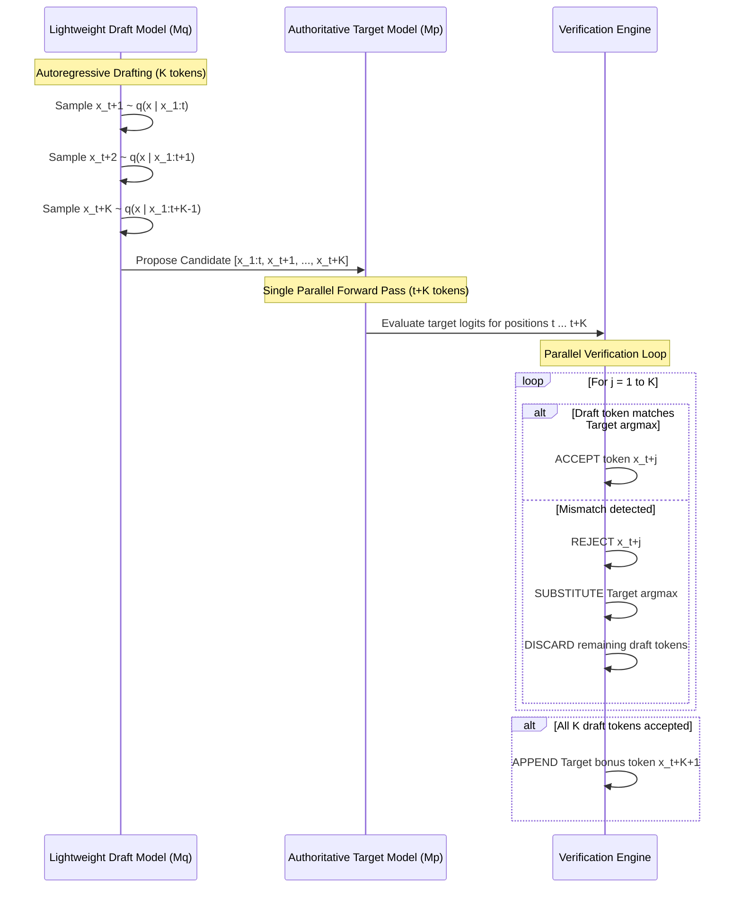

# Phase 21: Dynamic Model Routing & Speculative Decoding

This educational guide details the design, mathematics, and implementation of **Dynamic Model Routing** and **First-Principles Speculative Decoding** in Project Libra.

---

## 1. WHAT: System Capabilities & Deliverables

Phase 21 addresses the trade-offs of inference latency, computational cost, and hardware efficiency on consumer hardware (Intel Core i5, 16GB RAM, $0 budget). It delivers two complementary components:

1. **Dynamic Model Routing Engine (`packages/routing/`)**:
   - **Query Complexity & Intent Classifier (`QueryClassifier`)**: Analyzes input prompts and conversational history to calculate fine-grained complexity scores ($0.0 \to 1.0$) across length, code density, reasoning difficulty, and operational constraints.
   - **Tier Recommendation**: Automatically maps requests into four execution tiers:
     - `FAST_LOCAL`: Sub-50ms latency, zero financial cost (greetings, simple extractions, quick conversions).
     - `BALANCED`: 200–800ms latency, balanced performance (standard knowledge QA, summarization, general queries).
     - `FRONTIER_REASONING`: 1.0–3.5s latency, high-cognitive capability (complex algorithmic coding, mathematical proofs, constraint solving).
     - `MULTI_AGENT`: 3.0–10.0s latency, collaborative consensus loop (system architecture, multi-module decomposition).
   - **Dynamic Router (`DynamicRouter`)**: Implements user policy overrides (`auto`, `fast`, `balanced`, `quality`, `multi_agent`), maps active provider adapters, and orchestrates resilient multi-stage fallback cascades with explainable rationale.

2. **First-Principles Speculative Decoding Engine (`packages/models/speculative.py`)**:
   - **Leviathan et al. (2023) Draft-and-Verify Engine**: Pairs a lightweight draft model ($M_q$) with an authoritative target model ($M_p$).
   - **Parallel Verification**: In each iteration, $M_q$ rapidly drafts $K$ candidate tokens; $M_p$ evaluates all $K$ tokens simultaneously in a single forward pass.
   - **Exact Equivalence Invariant**: Under greedy decoding ($T=0$), speculative decoding is provably guaranteed to produce the exact same token sequence as standard target autoregressive generation.
   - **Comprehensive Telemetry**: Measures acceptance rate ($\alpha = \frac{\text{accepted}}{\text{proposed}}$), target passes saved, and theoretical speedup ratio ($S = \frac{\text{baseline passes}}{\text{target passes}}$).

3. **API Endpoints (`apps/backend/api/v1/endpoints/routing.py`)**:
   - `POST /api/v1/routing/classify`: Prompt intent and complexity breakdown.
   - `POST /api/v1/routing/decision`: Execution plan and fallback chain.
   - `POST /api/v1/routing/generate`: Dynamic routing with automatic fallback protection.
   - `POST /api/v1/routing/speculative`: Speculative decoding generation with speedup metrics.

---

## 2. WHY: Latency, Cost & Bandwidth Bottlenecks

### The Autoregressive Inference Bottleneck
Autoregressive language generation requires sequential token generation:
$$x_{t+1} \sim P(x \mid x_1, \dots, x_t)$$
To generate $N$ tokens, a standard transformer must execute $N$ sequential forward passes. In each forward pass:
- All model parameters ($W \in \mathbb{R}^{d \times d}$) must be loaded from RAM/VRAM to the compute cores (ALUs/registers).
- Since batch size for interactive chat is typically $B=1$, the arithmetic intensity (FLOPs per byte transferred) is very low. Autoregressive inference on CPUs and consumer GPUs is **memory-bandwidth bound**, not compute bound!

### The Multi-Model Routing Economics
Not every prompt requires a 70B parameter frontier model or an elaborate multi-agent consensus loop. Routing a simple greeting ("Hello!") or basic conversion ("Convert 5 miles to km") to a frontier reasoning model wastes compute, inflates latency (1–3s vs 20ms), and incurs unnecessary cost. Dynamic routing directs simple queries to lightweight local models and reserves frontier resources for complex multi-step reasoning.

---

## 3. HOW: Mathematical Foundations & Algorithms

### A. Speculative Decoding (Draft-and-Verify Algorithm)

Let $M_p$ be the target model with probability distribution $p(x)$ and $M_q$ be the draft model with distribution $q(x)$. Both models share vocabulary $\mathcal{V}$.
Let $K$ be the speculative lookahead window size.

Given conditioning sequence $x_{1:t}$:



#### Verification Rules:
1. **Greedy Verification ($T=0$)**:
   For $j = 0, \dots, K-1$:
   Let $\hat{x}_{t+1+j}$ be the draft token.
   Let $x^* = \operatorname{argmax}_{w \in \mathcal{V}} p(w \mid x_{1:t+j})$.
   - If $\hat{x}_{t+1+j} == x^*$: Accept the token and increment accepted count.
   - Else: Accept $x^*$ as the corrected token, reject remaining draft tokens, and terminate the step.
   - If all $K$ tokens are accepted: Accept a bonus token $x_{\text{bonus}} = \operatorname{argmax}_{w \in \mathcal{V}} p(w \mid x_{1:t+K})$.

2. **Expected Tokens per Step & Speedup**:
   If the token acceptance rate is $\alpha$, the expected number of accepted tokens per target model forward pass is:
   $$\mathbb{E}[\text{tokens per pass}] = \frac{1 - \alpha^{K+1}}{1 - \alpha}$$
   The theoretical speedup ratio in terms of target passes saved is:
   $$S = \frac{\text{Baseline Passes}}{\text{Target Passes}} = \frac{N}{\lceil N / \mathbb{E}[\text{tokens per pass}] \rceil}$$

### B. Query Complexity Breakdown Formulation
The composite complexity score $C \in [0.0, 1.0]$ is computed as:
$$C = w_{\text{len}} \cdot S_{\text{len}} + w_{\text{code}} \cdot S_{\text{code}} + w_{\text{reason}} \cdot S_{\text{reason}} + w_{\text{const}} \cdot S_{\text{const}}$$
where weights $\mathbf{w} = [0.15, 0.35, 0.35, 0.15]$ normalize to $\sum w_i = 1.0$.

---

## 4. TEST: Verification Results

All 21 Phase 21 test cases and all 254 project-wide tests pass cleanly:

```powershell
.\.venv\Scripts\pytest -v tests/routing/ tests/models/test_speculative_decoding.py tests/api/test_routing_endpoint.py
```

### Key Verified Invariants:
1. **Mathematical Equivalence**: `test_speculative_decoding_exact_mathematical_equivalence` proves that greedy speculative decoding produces the **exact identical token sequence** to standard autoregressive decoding from the target model.
2. **Telemetry Validation**: Target passes saved $\ge 0$, acceptance rate $\in [0, 1]$, speedup ratio $\ge 1.0$.
3. **Intent Monotonicity**: Query complexity scores strictly increase from simple greetings to multi-step algorithmic prompts.
4. **Fallback Cascading**: Unhealthy or rate-limited providers cascade transparently to mock or local safety nets without raising unhandled exceptions.

---

## 5. NEXT: Phase 22 Preview

With Dynamic Routing and Speculative Decoding established, **Phase 22** introduces **Reinforcement Learning from First Principles (RLHF & Direct Preference Optimization / DPO)**, implementing reward modeling, preference pair scoring, and policy optimization without external reinforcement learning dependencies.
