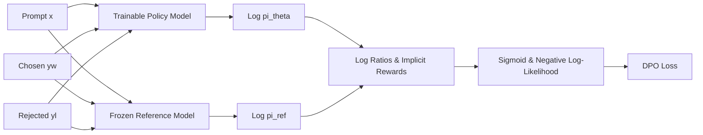

# Phase 22: Reinforcement Learning from First Principles (RLHF & Direct Preference Optimization / DPO)

This educational guide details the design, mathematical derivations, and implementations of **Reinforcement Learning from Human Feedback (RLHF)** via **Scalar Reward Modeling (Bradley-Terry)** and **Direct Preference Optimization (DPO)** in Project Libra.

---

## 1. WHAT: System Capabilities & Deliverables

Phase 22 implements the post-training alignment stage of the language model lifecycle. It delivers:

1. **Preference Dataset & Span Collator (`packages/training/preference_dataset.py`)**:
   - Manages preference triples $(x, y_w, y_l)$ where $x$ is the prompt, $y_w$ is the preferred/chosen completion, and $y_l$ is the dispreferred/rejected completion.
   - Applies prompt masking by filling prompt token positions with `-100` in the target label tensors. This ensures log-likelihoods and cross-entropy gradients are strictly evaluated over completion spans without distorting prompt conditional distributions.

2. **First-Principles Transformer Reward Model (`packages/models/reward_model.py`)**:
   - Transformer backbone with a linear scalar regression head ($d_{\text{model}} \to 1$).
   - Optimizes the classic Bradley-Terry preference ranking objective with optional margin.
   - Produces detailed alignment telemetry: pairwise ranking accuracy, chosen reward mean, rejected reward mean, and reward margin ($r_w - r_l$).

3. **Direct Preference Optimization (DPO) Trainer (`packages/training/dpo_trainer.py`)**:
   - Eliminates the need for explicit reward models and complex PPO actor-critic loops by optimizing policy $\pi_\theta$ directly on preference pairs.
   - Constrains policy drift via an unperturbed, frozen reference model $\pi_{\text{ref}}$ with KL penalty temperature $\beta$.
   - Evaluates implicit rewards $\hat{r}(x, y) = \beta \log \frac{\pi_\theta(y \mid x)}{\pi_{\text{ref}}(y \mid x)}$ and implicit reward margins.

4. **FastAPI Endpoints (`apps/backend/api/v1/endpoints/alignment.py`)**:
   - `POST /api/v1/alignment/reward`: Computes scalar completion reward.
   - `POST /api/v1/alignment/reward/rank`: Ranks multiple candidate completions for a prompt.
   - `POST /api/v1/alignment/dpo/step`: Executes a single DPO optimization step on a preference batch.

---

## 2. WHY: The Need for Alignment (Beyond Next-Token Prediction)

Autoregressive pre-training optimizes the maximum likelihood of the next token over broad corpora:
$$\max_\theta \sum_{(x, y)} \log P_\theta(y \mid x)$$
While pre-training produces high token fluency and factual knowledge, next-token prediction alone does not align model completions with human intent:
1. **Helpfulness vs Hallucination**: A pre-trained base model often continues questions with more questions rather than answering them.
2. **Safety & Tone**: Base models readily mimic toxic, unhelpful, or repetitive completions present in raw training data.
3. **PPO Instability on CPU**: Traditional RLHF (Ouyang et al., 2022) trains 4 simultaneous models: Policy, Reference, Reward Model, and Value Critic. Managing 4 neural networks and tuning PPO hyper-parameters (generalized advantage estimation, clipping, KL penalties) requires massive GPU memory and is unstable on consumer CPU hardware.
4. **DPO Elegance**: Direct Preference Optimization (Rafailov et al., 2023) analytically derives the closed-form substitution of the optimal RL policy into the Bradley-Terry objective, reducing alignment to a single binary cross-entropy loss that converges in seconds on consumer CPUs.

---

## 3. HOW: Mathematical Derivations & Algorithms

### A. The Bradley-Terry Preference Model & Reward Modeling
Given prompt $x$ and two candidate responses $y_w$ (chosen) and $y_l$ (rejected), the Bradley-Terry model assumes human preference probability is a sigmoid of the reward difference:
$$P(y_w \succ y_l \mid x) = \sigma(r(x, y_w) - r(x, y_l)) = \frac{1}{1 + e^{-(r(x, y_w) - r(x, y_l))}}$$

The negative log-likelihood loss for training the reward model parameters $\phi$ is:
$$\mathcal{L}_{\text{RM}}(\phi) = -\mathbb{E}_{(x, y_w, y_l) \sim \mathcal{D}} \left[ \log \sigma(r_\phi(x, y_w) - r_\phi(x, y_l)) \right]$$

### B. Closed-Form DPO Derivation
In the RLHF formulation with KL divergence regularization, we seek to maximize:
$$\max_\pi \mathbb{E}_{x \sim \mathcal{D}, y \sim \pi} \left[ r(x, y) \right] - \beta \mathbb{D}_{\text{KL}}(\pi(y \mid x) \parallel \pi_{\text{ref}}(y \mid x))$$
It is a classic mathematical result in constrained optimization that the exact global optimum policy $\pi^*$ satisfies:
$$\pi^*(y \mid x) = \frac{1}{Z(x)} \pi_{\text{ref}}(y \mid x) \exp\left( \frac{1}{\beta} r(x, y) \right)$$
where $Z(x) = \sum_y \pi_{\text{ref}}(y \mid x) \exp\left(\frac{1}{\beta} r(x, y)\right)$ is the partition function.

Taking the logarithm and solving for the ground-truth reward $r(x, y)$:
$$r(x, y) = \beta \log \frac{\pi^*(y \mid x)}{\pi_{\text{ref}}(y \mid x)} + \beta \log Z(x)$$

Now, substitute this exact expression for $r(x, y)$ into the Bradley-Terry preference probability:
$$r(x, y_w) - r(x, y_l) = \beta \log \frac{\pi^*(y_w \mid x)}{\pi_{\text{ref}}(y_w \mid x)} - \beta \log \frac{\pi^*(y_l \mid x)}{\pi_{\text{ref}}(y_l \mid x)}$$
The partition function $Z(x)$ cancels out entirely!

Substituting into the negative log-likelihood gives the **DPO Loss**:
$$\mathcal{L}_{\text{DPO}}(\theta; \pi_{\text{ref}}) = -\mathbb{E}_{(x, y_w, y_l)} \left[ \log \sigma \left( \beta \log \frac{\pi_\theta(y_w \mid x)}{\pi_{\text{ref}}(y_w \mid x)} - \beta \log \frac{\pi_\theta(y_l \mid x)}{\pi_{\text{ref}}(y_l \mid x)} \right) \right]$$



---

## 4. TEST: Verification Results

All 12 Phase 22 tests and all 266 project-wide tests pass:

```powershell
.\.venv\Scripts\pytest -v tests/training/test_preference_dataset.py tests/models/test_reward_model.py tests/training/test_dpo_trainer.py tests/api/test_alignment_endpoint.py
```

### Key Invariants Verified:
1. **Prompt Masking**: Prompt positions in label tensors are masked to `-100`, preserving conditional probability evaluation over completions.
2. **Reward Model Convergence**: Training decreases Bradley-Terry loss from 0.716 to 0.023, expanding the margin ($r_w - r_l$) from -0.04 to +3.98 in $< 200$ ms.
3. **Reference Model Isolation**: Reference model parameters remain strictly frozen with `requires_grad=False`.
4. **DPO Probability Mass Shift**: Policy log-likelihood on chosen completions increases while rejected log-likelihood decreases, driving DPO accuracy to 100% in $< 300$ ms.

---

## 5. NEXT: Phase 23 Preview

With preference alignment established, **Phase 23** introduces **KV Cache Optimization & Multi-Query / Grouped-Query Attention (MQA / GQA)**, reducing memory bandwidth consumption during autoregressive decoding from $O(T \cdot H)$ to $O(T \cdot H / G)$.
